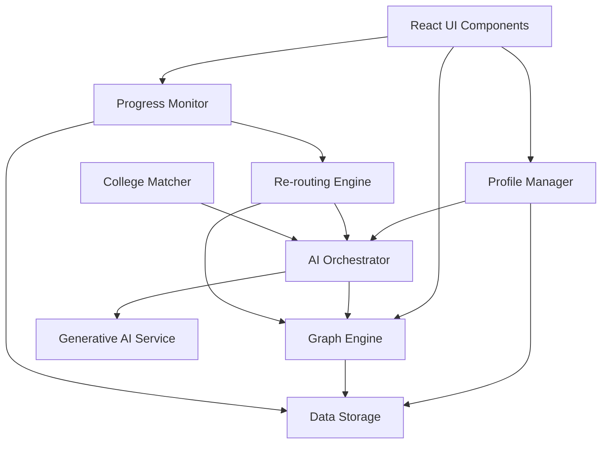

# Design Document: AI-Powered Career Navigation

## Overview

The AI-Powered Career Navigation enhancement transforms the SKLG Career Navigator from a static recommendation system into a dynamic, intelligent platform that adapts to student progress and circumstances. The design leverages Generative AI for personalized recommendations and natural language generation, implements a graph-based data structure for flexible career path modeling, and provides continuous monitoring with intelligent re-routing capabilities.

The system architecture follows a layered approach:
- **Presentation Layer**: React components for visualization (career maps, timelines, comparisons)
- **Application Layer**: Business logic for profile management, recommendation orchestration, and progress tracking
- **AI Integration Layer**: Interfaces to Generative AI models for analysis and content generation
- **Data Layer**: Graph structures, profile storage, and persistence mechanisms

## Architecture

### High-Level Architecture



### Component Interaction Flow

1. **Profile Creation**: Student → Profile Manager → Storage → AI Orchestrator → Generative AI
2. **Career Recommendation**: AI Orchestrator → Generative AI → Graph Engine → UI
3. **Roadmap Generation**: Graph Engine → AI Orchestrator → Generative AI → UI
4. **Progress Tracking**: UI → Progress Monitor → Storage → Re-routing Engine (if deviation detected)
5. **Dynamic Re-routing**: Re-routing Engine → Graph Engine → AI Orchestrator → UI

## Components and Interfaces

### 1. Profile Manager

**Responsibility**: Manage student profile data including creation, updates, validation, and retrieval.

**Interface**:
```typescript
interface StudentProfile {
  id: string;
  name: string;
  age: number;
  educationLevel: 'school' | 'undergraduate' | 'graduate' | 'working';
  interests: string[];
  careerGoals: string[];
  hobbies: string[];
  location: string;
  aptitudeScores?: Record<string, number>;
  academicRecords?: AcademicRecord[];
  currentCareer?: string; // For career switchers
  yearsExperience?: number;
 AI
}
```

### 2. AI Orchestrator

**Responsibility**: Interface with Generative AI models, format prompts, parse responses, and handle errors.

**Interface**:
```typescript
interface CareerRecommendation {
  careerId: string;
  title: string;
  description: string;
  suitabilityScore: number; // 0-100
  explanation: string; // Natural language from AI
  requiredSkills: string[];
  routes: string[]; // Route IDs
}

interface MilestoneDescription {
  id: string;
  type: 'exam' | 'certification' | 'skill' | 'college' | 'internship' | 'experience';
  title: string;
  description: string;
  estimatedDuration: number; // months
  difficulty: 'easy' | 'medium' | 'hard';
  resources: Resource[];
  prerequisites: string[]; // Milestone IDs
}

interface Resource {
  type: 'course' | 'book' | 'website' | 'practice';
  title: string;
  url?: string;
  description: string;
}

interface AIOrchestrator {
  generateCareerRecommendations(profile: StudentProfile): Promise<CareerRecommendation[]>;
  generateRoadmap(profile: StudentProfile, careerId: string, routeId: string): Promise<MilestoneDescription[]>;
  generateMilestoneGuidance(milestone: MilestoneDescription, profile: StudentProfile): Promise<string>;
  explainReRoute(currentRoute: Route, newRoute: Route, reason: string): Promise<string>;
}
```

**AI Prompt Engineering**:
- Career recommendations use structured prompts with profile data, requesting JSON responses
- Roadmap generation includes context about student's current stage and career destination
- Fallback to rule-based system if AI service is unavailable

### 3. Graph Engine

**Responsibility**: Model career paths as graphs, manage routes, calculate paths, and support graph operations.

**Data Structures**:
```typescript
interface GraphNode {
  id: string;
  type: 'start' | 'milestone' | 'destination';
  milestoneData?: MilestoneDescription;
  position: { x: number; y: number }; // For visualization
}

interface GraphEdge {
  from: string; // Node ID
  to: string; // Node ID
  weight: number; // Difficulty/time cost
  conditions?: string[]; // Prerequisites
}

interface CareerGraph {
  careerId: string;
  nodes: Map<string, GraphNode>;
  edges: GraphEdge[];
  routes: Route[];
}

interface Route {
  id: string;
  name: string;
  nodeSequence: string[]; // Ordered node IDs
  totalDuration: number; // months
  difficulty: 'easy' | 'medium' | 'hard';
  cost: 'low' | 'medium' | 'high';
  description: string;
}

interface GraphEngine {
  buildCareerGraph(careerId: string, milestones: MilestoneDescription[]): CareerGraph;
  findAllRoutes(graph: CareerGraph, startNode: string, endNode: string): Route[];
  calculateShortestRoute(graph: CareerGraph, startNode: string, endNode: string): Route;
  getNodesByType(graph: CareerGraph, type: string): GraphNode[];
  validateRoute(route: Route, graph: CareerGraph): boolean;
  serializeGraph(graph: CareerGraph): string; // For storage
  deserializeGraph(data: string): CareerGraph;
}
```

**Graph Construction Algorithm**:
1. Create start node based on student's current education level
2. Create milestone nodes from AI-generated roadmap
3. Create destination node for career goal
4. Generate edges based on milestone prerequisites and logical progression
5. Calculate multiple routes using depth-first search with constraints
6. Assign positions for visualization using force-directed layout

### 4. Progress Monitor

**Responsibility**: Track student progress, detect deviations, and trigger re-routing.

**Interface**:
```typescript
interface ProgressState {
  studentId: string;
  careerId: string;
  currentRouteId: string;
  currentNodeId: string;
  completedNodes: string[];
  nodeProgress: Map<string, NodeProgress>; // Node ID -> Progress
  overallCompletion: number; // 0-100
  lastUpdated: Date;
}

interface NodeProgress {
  nodeId: string;
  status: 'not_started' | 'in_progress' | 'completed' | 'failed' | 'skipped';
  startDate?: Date;
  completionDate?: Date;
  evidence?: string; // URL or description
  timeSpent: number; // days
}

interface Deviation {
  type: 'timeline_delay' | 'milestone_failure' | 'interest_change' | 'manual_request';
  severity: 'low' | 'medium' | 'high';
  description: string;
  detectedAt: Date;
}

interface ProgressMonitor {
  updateProgress(studentId: string, nodeId: string, progress: Partial<NodeProgress>): Promise<ProgressState>;
  getProgress(studentId: string): Promise<ProgressState>;
  detectDeviations(studentId: string): Promise<Deviation[]>;
  calculateCompletion(progress: ProgressState, graph: CareerGraph): number;
  estimateTimeToCompletion(progress: ProgressState, route: Route): number; // months
}
```

**Deviation Detection Logic**:
- Timeline delay: Compare actual time spent vs. estimated duration (threshold: 150% of estimate)
- Milestone failure: Explicit failure status on critical nodes (entrance exams, certifications)
- Interest change: Profile updates that significantly alter career fit scores
- Manual request: Student explicitly requests alternative route

### 5. Re-routing Engine

**Responsibility**: Calculate alternative routes when deviations occur, preserving career destination.

**Interface**:
```typescript
interface ReRoutingOptions {
  preserveDestination: boolean; // Always true for career goal
  considerCompleted: boolean; // Don't repeat completed milestones
  maxRoutes: number; // Number of alternatives to generate
  optimizeFor: 'time' | 'cost' | 'difficulty';
}

interface ReRoutingResult {
  originalRoute: Route;
  alternativeRoutes: Route[];
  recommendation: Route; // Best alternative
  explanation: string; // From AI
  impactAnalysis: {
    timeDifference: number; // months
    costDifference: string;
    difficultyChange: string;
  };
}

interface ReRoutingEngine {
  calculateAlternatives(
    studentId: string,
    deviation: Deviation,
    options: ReRoutingOptions
  ): Promise<ReRoutingResult>;
  
  applyReRoute(studentId: string, newRouteId: string): Promise<ProgressState>;
  
  compareRoutes(route1: Route, route2: Route): RouteComparison;
}

interface RouteComparison {
  durationDiff: number;
  difficultyDiff: string;
  costDiff: string;
  uniqueMilestones: {
    route1Only: string[];
    route2Only: string[];
    common: string[];
  };
}
```

**Re-routing Algorithm**:
1. Retrieve current progress state and career graph
2. Identify completed nodes (must be preserved in new route)
3. Find all valid routes from current position to destination
4. Filter routes that include completed nodes in correct order
5. Score routes based on optimization criteria (time/cost/difficulty)
6. Use AI to generate natural language explanation for top recommendation
7. Return ranked alternatives with impact analysis

### 6. College Matcher

**Responsibility**: Recommend colleges aligned with career paths and student preferences.

**Interface**:
```typescript
interface College {
  id: string;
  name: string;
  location: string;
  type: 'government' | 'private' | 'deemed';
  programs: Program[];
  entranceExams: string[];
  ranking?: number;
  tuitionRange: { min: number; max: number };
}

interface Program {
  name: string;
  degree: string;
  specializations: string[];
  duration: number; // years
}

interface CollegeRecommendation {
  college: College;
  fitScore: number; // 0-100
  matchingPrograms: Program[];
  explanation: string;
  pros: string[];
  cons: string[];
}

interface CollegeMatcher {
  recommendColleges(
    careerId: string,
    profile: StudentProfile,
    filters?: CollegeFilters
  ): Promise<CollegeRecommendation[]>;
  
  getCollegeDetails(collegeId: string): Promise<College>;
  
  filterColleges(colleges: College[], filters: CollegeFilters): College[];
}

interface CollegeFilters {
  location?: string[];
  type?: ('government' | 'private' | 'deemed')[];
  maxTuition?: number;
  requiredPrograms?: string[];
  entranceExams?: string[];
}
```

**College Matching Algorithm**:
1. Extract career-relevant programs and specializations
2. Query college database for matching programs
3. Apply student filters (location, type, tuition)
4. Calculate fit score based on:
   - Program alignment with career (40%)
   - Location preference match (20%)
   - Academic record vs. college requirements (20%)
   - Entrance exam compatibility (20%)
5. Use AI to generate explanations and pros/cons
6. Return top N colleges ranked by fit score

## Data Models

### Storage Schema

**Student Profiles** (JSON in localStorage or backend DB):
```json
{
  "id": "student_123",
  "name": "John Doe",
  "age": 17,
  "educationLevel": "school",
  "interests": ["Technology", "Mathematics"],
  "careerGoals": ["Software Engineer"],
  "hobbies": ["coding", "chess"],
  "location": "India",
  "aptitudeScores": {
    "logical": 85,
    "verbal": 72,
    "quantitative": 90
  },
  "academicRecords": [
    {
      "institution": "ABC High School",
      "degree": "10th Grade",
      "grade": "92%",
      "year": 2023
    }
  ]
}
```

**Career Graphs** (Serialized JSON):
```json
{
  "careerId": "software-engineer",
  "nodes": {
    "start": {
      "id": "start",
      "type": "start",
      "position": { "x": 50, "y": 200 }
    },
    "entrance_exam": {
      "id": "entrance_exam",
      "type": "milestone",
      "milestoneData": {
        "id": "entrance_exam",
        "type": "exam",
        "title": "JEE Main",
        "description": "National level engineering entrance exam",
        "estimatedDuration": 6,
        "difficulty": "hard",
        "resources": [],
        "prerequisites": []
      },
      "position": { "x": 200, "y": 150 }
    }
  },
  "edges": [
    { "from": "start", "to": "entrance_exam", "weight": 6, "conditions": [] }
  ],
  "routes": [
    {
      "id": "route1",
      "name": "Traditional Academic",
      "nodeSequence": ["start", "entrance_exam", "college", "destination"],
      "totalDuration": 48,
      "difficulty": "medium",
      "cost": "medium",
      "description": "Standard path through entrance exams and college"
    }
  ]
}
```

**Progress State** (JSON):
```json
{
  "studentId": "student_123",
  "careerId": "software-engineer",
  "currentRouteId": "route1",
  "currentNodeId": "entrance_exam",
  "completedNodes": ["start"],
  "nodeProgress": {
    "entrance_exam": {
      "nodeId": "entrance_exam",
      "status": "in_progress",
      "startDate": "2024-01-15T00:00:00Z",
      "timeSpent": 45
    }
  },
  "overallCompletion": 15,
  "lastUpdated": "2024-03-01T10:30:00Z"
}
```


## Correctness Properties

A property is a characteristic or behavior that should hold true across all valid executions of a system—essentially, a formal statement about what the system should do. Properties serve as the bridge between human-readable specifications and machine-verifiable correctness guarantees.

### Property 1: Profile Creation Completeness
*For any* student profile creation request with all required fields (name, age, education level, interests, career goals, hobbies, location), the created profile object should contain all provided fields with their original values.
**Validates: Requirements 1.1**

### Property 2: Profile Update Persistence
*For any* student profile and any valid update data, updating the profile then retrieving it should return a profile with the updated values applied.
**Validates: Requirements 1.2**

### Property 3: Aptitude Score Integration
*For any* stude
